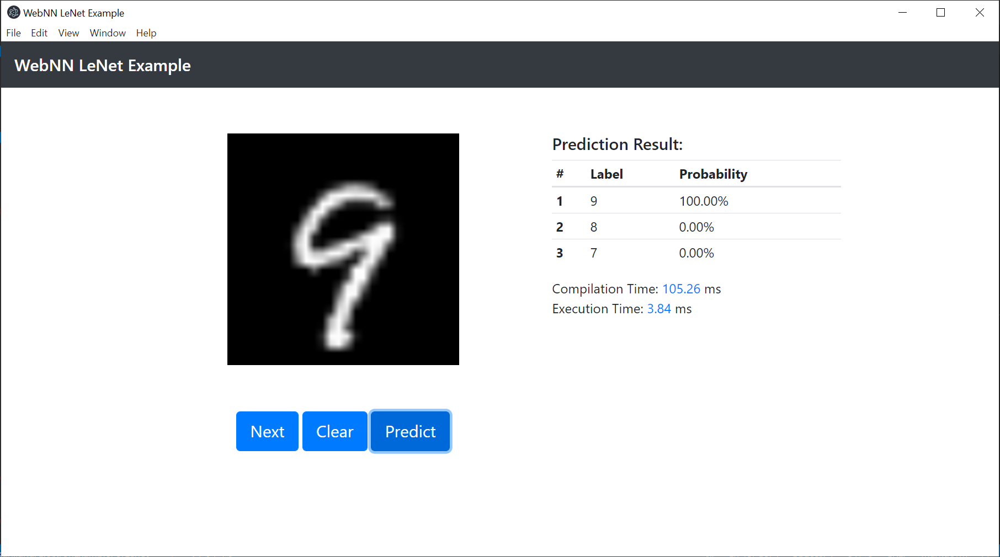

# An Electron.js example of lenet using webnn-native

The weight file of the Lenet is stored at the path `<examples_path>\lenet\lenet.bin`.

### Install

```
$ npm install
```

### Run 

```bash
npm run start
```

### Screenshot

